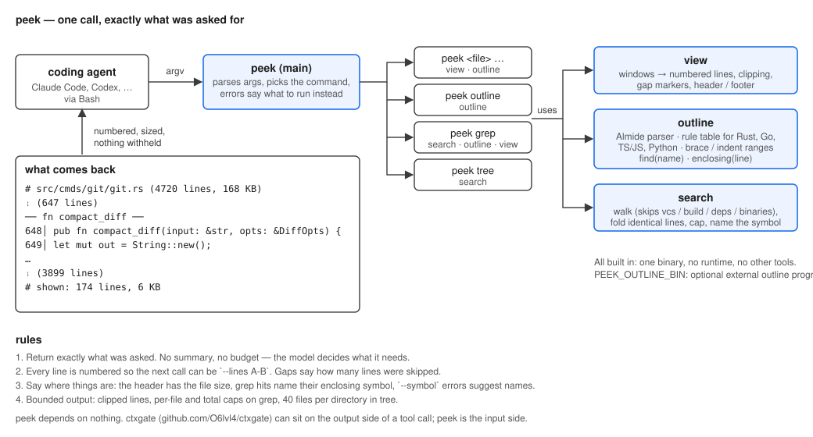

# hew

Read code the way a model should. `hew` is a replacement for the `cat` / `grep` / `sed -n` /
`awk '/^fn x/,/^}/'` pipelines that coding agents run hundreds of times a session, built so
that every call returns exactly what was asked for, numbered, sized, and aware of the code's
structure.

[日本語](README_ja.md)

```
hew src/lower.rs --symbol lower_match       one function, found by name
hew src/lower.rs --grep "Expr::Match" --around 4   matches with context, labelled by enclosing fn
hew src/lower.rs --lines 120-160            a range, numbered
hew outline src/lower.rs                    the table of contents
hew grep "unwrap()" src                     grep that folds repeats and names the symbol
hew tree src --depth 2                      a directory, skipping vcs / build / deps
```

## Why

An agent that reads a 4,000-line file to answer a question about one function pays for the
whole file on every later turn. Agents know this, and narrow with shell pipelines. Those
pipelines are brittle (`awk` ranges break on nested braces, `sed -n` needs line numbers the
model has to find first, `grep -n` results say nothing about *where* a match is). `hew`
does the narrowing properly, once, in one binary:

- **Structure-aware.** `--symbol` cuts out a function, type, class, impl method or test by
  name. Almide, Rust, Go, TypeScript/JavaScript and Python are parsed built in, with no
  dependencies. An external outline program can be plugged in with `HEW_OUTLINE_BIN` if you
  want tree-sitter accuracy.
- **Numbered and sized.** Every line carries its number so the next call can be
  `--lines A-B`. Long lines are clipped. Gaps are marked with how many lines were skipped.
  The header says how big the whole file is; the footer says how much was shown.
- **Grep that tells you where.** Matches are grouped per file, identical lines are folded
  (`×3`), each match names the enclosing symbol, per-file and total caps keep the output
  bounded.
- **Never withholds.** `hew` only returns what was asked for. There is no summarisation and
  no budget; the model decides.

## What the model sees

```
$ hew src/cmds/git/git.rs --symbol compact_diff
# src/cmds/git/git.rs  (4720 lines, 168 KB)
       ⋮  (647 lines)
     ── fn compact_diff ──
 648│ pub fn compact_diff(input: &str, opts: &DiffOpts) -> String {
 649│     let mut out = String::new();
 …
 821│ }
       ⋮  (3899 lines)
# shown: 174 lines, 6 KB
```

```
$ hew grep "fn run_" src/cmds/git
# 14 matches in 3 files
src/cmds/git/git.rs  (9)
  112│ pub fn run_diff(args: &[String]) -> Result<()>    ‹run_diff›
  230│ pub fn run_log(args: &[String]) -> Result<()>     ‹run_log›
  …
src/cmds/git/stash.rs  (2)
   40│ pub fn run_stash(args: &[String]) -> Result<()>   ‹run_stash›
```

```
$ hew src/lower.rs --grep "Expr::Match" --around 2
# src/lower.rs  (1210 lines, 41 KB)
       ⋮  (310 lines)
     ── in fn lower_expr ──
 311│         Expr::If { .. } => self.lower_if(e),
 312│         Expr::Match { scrutinee, arms } => self.lower_match(scrutinee, arms),
 313│         Expr::Block(b) => self.lower_block(b),
       ⋮  (402 lines)
     ── in fn lower_match ──
 716│     // Expr::Match with a single arm is a let
 …
# shown: 12 lines, 640 B
```

## Install

```bash
almide install github.com/O6lvl4/hew      # one native binary → ~/.local/bin/hew
```

One binary, no runtime, no other tools required. Optionally, `HEW_OUTLINE_BIN=<program>`
names an outline provider (called with a path, must print
`{"lang","total_lines","symbols":[{"kind","name","start","end"}]}`); when set, its answer is
used for `--symbol`, `outline` and grep labels, for any language it knows. Any tree-sitter
based tool that speaks this contract can be plugged in; hew itself does not know or need any.

## Teach your agent

Add to `CLAUDE.md` (or the equivalent for your agent):

```
Read code with `hew`, not cat / sed -n / awk:
- `hew <file> --symbol NAME`            one function or type
- `hew <file> --grep RE [--around N]`   matches with context
- `hew <file> --lines A-B`              a range (output is numbered, so you can come back)
- `hew outline <file|dir>`              what is in a file before reading it
- `hew grep RE [path]`                  search that names the enclosing symbol
```

## Commands

```
hew <file> [--lines A-B] [--symbol NAME] [--grep RE] [--around N] [--head N] [--tail N] [--clip N]
hew outline <file|dir> [--max N]
hew grep <RE> [path...] [--per-file N] [--max-files N] [--clip N]
hew tree <dir> [--depth N]
```

`--around` defaults to 3, `--clip` to 200 characters, `--per-file` to 20 matches,
`--max-files` to 50. Regexes are Rust-syntax without `\b` or lazy quantifiers (Almide's
regex). `grep` and `tree` skip `.git`, `target`, `node_modules`, `dist`, `build`, `vendor`,
virtualenvs and files over 2 MB.

## Architecture



The agent calls `hew` through Bash. `main` parses the arguments, picks the command and
composes three modules:

- **view** — takes the line windows to show and produces numbered lines, clipping, gap
  markers, header and footer.
- **outline** — the table of contents. Almide has its own parser; Rust / Go / TS·JS / Python
  use a per-language table of declaration rules and get their ranges from brace matching
  (indentation for Python). `find(name)` looks a symbol up by name, `enclosing(line)` by line.
- **search** — walks directories (skipping vcs / build / deps / binaries), groups matches per
  file, folds identical lines, applies caps, and asks outline for the enclosing symbol.

Everything is built in. `HEW_OUTLINE_BIN` can name an external outline program whose JSON
answer replaces the built-in rules.

Written in [Almide](https://github.com/almide/almide). Dual-licensed MIT / Apache-2.0.
